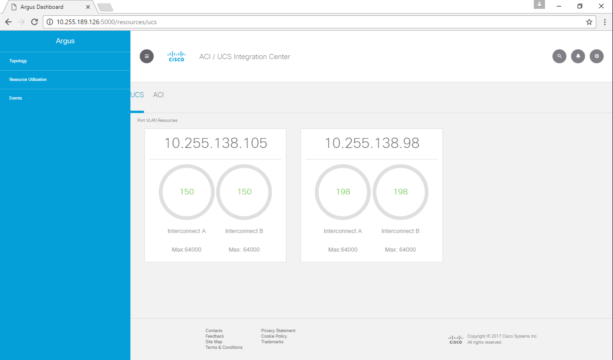
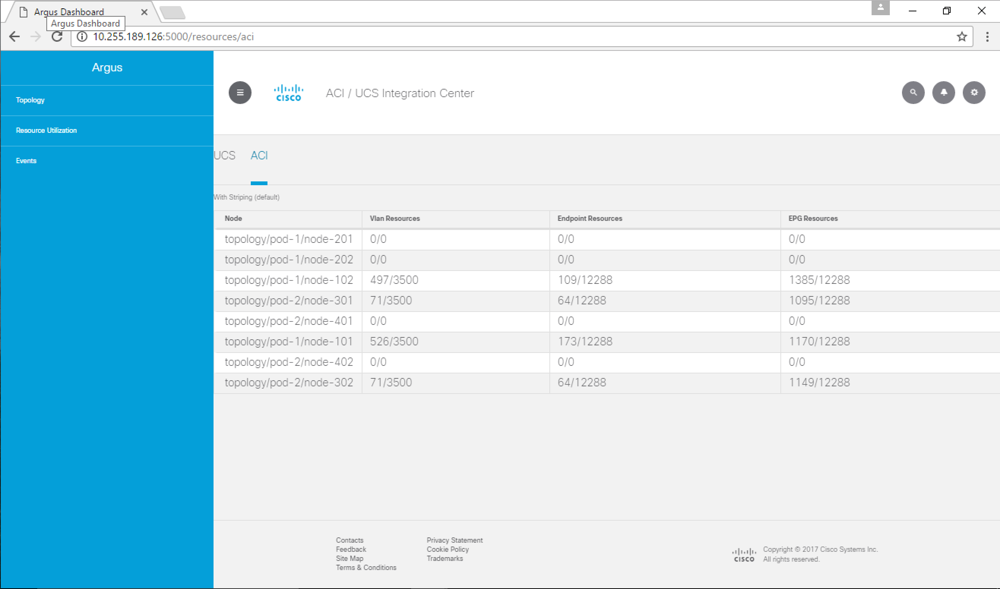
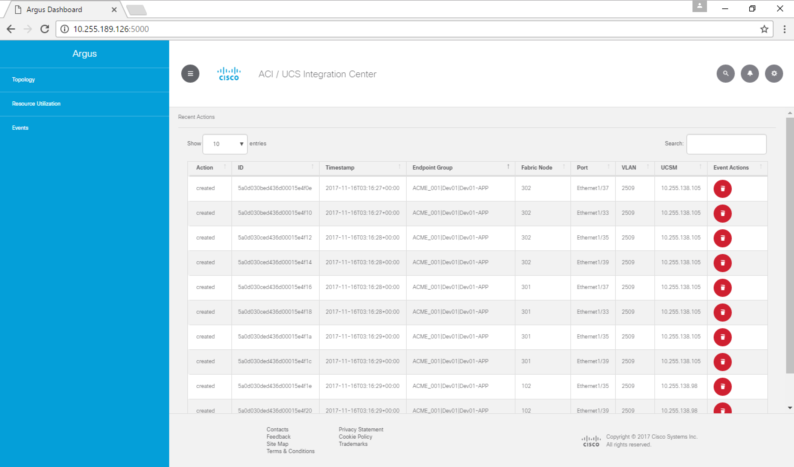
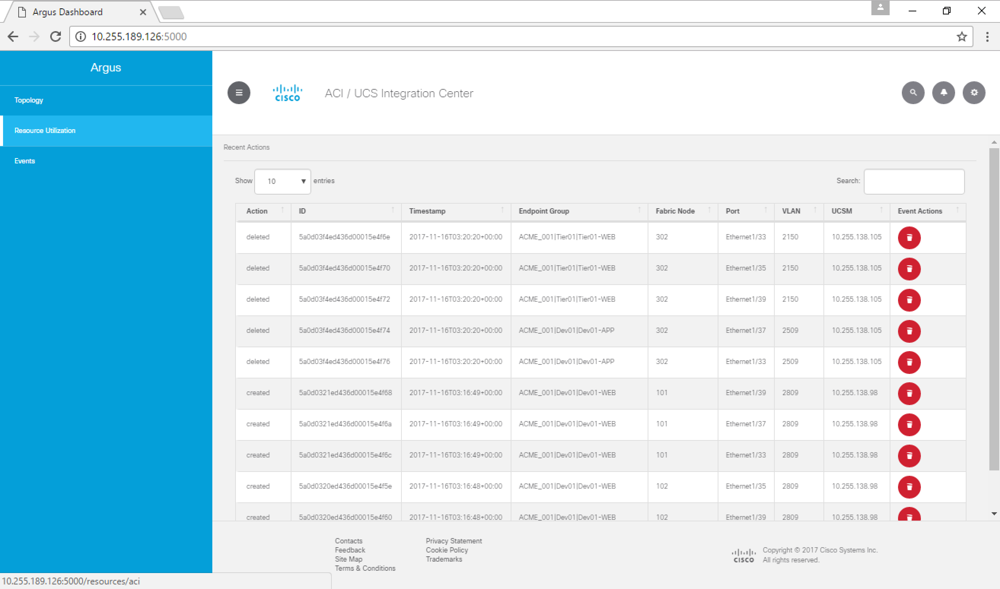

# argus

Argus is a proof of concept for demonstrating the programmability capabilities of UCS and ACI


# Scenario

In a standard VMM integration the dynamic VLAN pool must be pre-provisioned on the UCS Fabric
Interconnects. In very dense deployments this can exhaust logical port resources on FI's.  This exhaustion
is artificial if not all VLAN's are actually needed by VM's hosted in the UCS pod.


# Solution

We will monitor the ACI fabric for notification when policy is provisioned on a given leaf/port, glean
the required information from the notification, and then proceed to provision the required last
mile connectivity onto the appropriate UCS resources (FI's, vNICs, Uplinks)


# Usage: Installation and Web Interface

## Installation

The easiest way to get started is using Docker

***System requirements for installation instructions below: GIT, Docker, and Docker-Compose***


Step 1) Clone the argus repository from GitHub.

```
git clone https://github.com/kecorbin/argus
```

Step 2) Change local directory to the argus project directory.

```
cd argus
```

Step 3) Edit the docker-compose.yml file in the argus project directory to configure ACI integration. You will need the APIC address and credentials. Currently there are two locations as shown below.

```
  web:
    ...
    ...
    environment:
      ...
      ...
      APIC_LOGIN: APIC-USERNAME
      APIC_URL: http://APIC-IP-ADDRESS
      APIC_PASSWORD: APIC-PASSWORD
      ...
```

```
  argus:
    ...
    ...
    environment:
      APIC_LOGIN: APIC-USERNAME
      APIC_URL: http://APIC-IP-ADDRESS
      APIC_PASSWORD: APIC-PASSWORD
      ...
```

Step 4) Edit the config.py file in the argus project directory to configure UCS integration. 

Set UCSM Credentials.
```
# ucs info credentials
UCSM_LOGIN = 'UCSM-USERNAME'
UCSM_PASSWORD = 'UCSM-PASSWORD'
```
***In the event of multiple UCS Domains, these credentials need to be consistant.***

Set the variable for the VLAN Group in UCSM associated with the vNIC Template tied to the Service Profile used for the host servers.
```
VLAN_GROUP_DN = 'fabric/lan/net-group-YOUR-DVS-01'
DVS_NAME = 'YOUR-DVS-01'
```
***Need to add a section showing UCS Config of VLAN Groups and how to get the DN. Need clarification on what DVS_NAME = 'YOUR-DVS-01' actually does.***

Set the variable for the VLAN Group in UCSM associated with the Uplink Ports/Port Channels. This is required in a disjoint L2 situation.
```
UPLINK_VLAN_GROUP_DN = 'fabric/lan/net-group-Uplink-YOUR-DVS-01'
UPLINK_DVS_NAME = 'Uplink-YOUR-DVS-01'
```
***Need to add a section showing UCS Config of VLAN Groups and how to get the DN. Need clarification on what UPLINK_DVS_NAME = 'Uplink-YOUR-DVS-01' actually does.***

Configure UCSM VIP mappings to Fabric Interconnect real IP addresses. The column of IP addresses on the left are for the real IP's of the Fabric Interconnects while the column of IP addresses on the right are for the VIP of the UCSM.
```
UCSM_VIP_MAP = {
    '111.111.111.112': '111.111.111.111',
    '111.111.111.113': '111.111.111.111',
    '222.222.222.222': '222.222.222.221',
    '222.222.222.223': '222.222.222.221'
}
```
***The example above is for TWO UCS Domains. If you only have one you will need to comment out or delete the lines not used. If you have more than two domains you will need to add entries following the pattern set above.***

Configure Fabric Interconnect real IP address mappings to UCSM VIPs.
```
UCS = {
    '111.111.111.111': {
        "FI_A": '111.111.111.112',
        "FI_B": '111.111.111.113'
    },
    '222.222.222.221': {
        "FI_A": '222.222.222.222',
        "FI_B": '222.222.222.223'
    }
}
```
***The example above is for TWO UCS Domains. If you only have one you will need to comment out or delete the lines not used. If you have more than two domains you will need to add entries following the pattern set above.***


Step X) Build the argus container environement with Docker-Compose.
```
docker-compose build
```

Step X) Bring the argus container environement online with Docker-Compose.
```
docker-compose up -d
```

Step X) Installation Validation:
Argus should now be up and running in daemon mode. We can validate via CLI by executing "docker-compose ps" from within the argus project directory.
```
ucsuser@ucsub01:~/argus$ docker-compose ps
    Name                  Command             State           Ports
----------------------------------------------------------------------------
argus_argus_1   python argus.py               Up
argus_mongo_1   docker-entrypoint.sh mongod   Up      27017/tcp
argus_web_1     python api.py                 Up      0.0.0.0:5000->5000/tcp
ucsuser@ucsub01:~/argus$
```

Environment logs may also be viewed via CLI by executing "docker-compose logs -f argus" from within the argus project directory.
``` 
ucsuser@ucsub01:~/argus$ docker-compose logs -f argus
```

## Argus Web Interface

The Argus Web Interface is accessible by default on tcp5000 of the server running the Argus container environement.
```
http://{ARGUS-SERVER-IP}:5000
```

There are currently three areas of interest within the Argus Web Interface: Topology, Resource Utilization, and Events

### Topology
The Topology view, as shown below, provides a visualization of the ACI and UCS environment.

 


### Resource Utilization
Argus is capable of reporting the resource utilization of both UCS and ACI environements.

#### Argus UCS Resource Utilization Reporting




#### Argus ACI Resource Utilization Reporting




### Events
Argus tracks and archives every action taken as an Event. Actions include the creation, modification, and deletion of VLANs. The screen captures below show the granularity of the contextual data collected and recorded every time an action is taken by Argus. 
 





